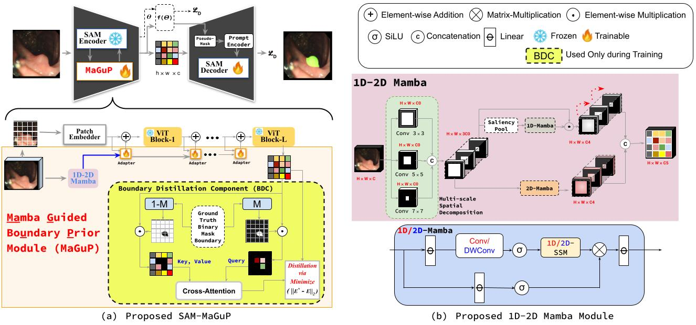

# 🎯 [MICCAI'25] 🏆 **SAM-MaGuP**: Mamba-Guided Boundary Prior for Polyp Segmentation 🚀  

## 🌟 Overview  
Detecting colorectal polyps with precision is critical for early cancer detection, yet challenges like blurry boundaries and variable polyp shapes make this task complex. **SAM-MaGuP** is a groundbreaking framework that supercharges the **Segment Anything Model (SAM)** with advanced boundary-focused innovations.  

### 🔑 **Key Features:**  
- ✨ **Boundary Distillation Component (BDC):** Refines weak boundaries for superior accuracy.  
- 🔍 **1D-2D Mamba Adapter:** Bridges spatial and channel dependencies at multiple scales.  
- 🏆 **State-of-the-Art Performance:** Excels across five benchmark datasets.  

  

---

## 💡 Highlights  
- 🧠 **Boundary Refinement:** Tackles low-contrast regions with precision.  
- 🌐 **Multi-Scale Context:** Captures long-range dependencies for robust segmentation.  
- ⚡ **Generalization Power:** Handles unseen datasets with unmatched accuracy.  
- 🎯 **Clinical Relevance:** Designed for real-world medical applications.  

---

## 🛠️ Architecture  
**SAM-MaGuP** combines:  
1. **MaGuP Module:**  
   - **Multi-scale Spatial Decomposition (MSD):** Extracts coarse-to-fine polyp features.  
   - **Boundary Distillation Component (BDC):** Enhances polyp boundary recognition with cross-attention.  
2. **SAM Backbone:** Enhanced with domain-specific knowledge for medical imaging.  

---

## 📊 Results  

### **🚀 Quantitative Metrics:**  
SAM-MaGuP sets new benchmarks across diverse datasets:  
- **mDice:** 94.7% on seen datasets.  
- **mIoU:** 89.0% on Kvasir-SEG.  
- **Boundary Precision:** 85.4% on challenging ETIS dataset.  

### **🖼️ Qualitative Improvements:**  
- Accurate polyp segmentation, even in ambiguous regions.  
- Strong performance on unseen datasets.  

---

## 🚀 Getting Started  

### Prerequisites  
- **Python:** >= 3.8  
- **PyTorch:** >= 2.0  
- **CUDA:** Enabled GPU (e.g., NVIDIA A100)  

### Installation  
1. Clone the repository:  
   ```bash  
   git clone https://github.com/username/SAM-MaGuP.git  
   cd SAM-MaGuP  

2. Install dependencies:
   ```bash
    pip install -r requirements.txt

4. Download the datasets: Kvasir-SEG, CVC-ClinicDB, ETIS, CVC-ColonDB, CVC-300. and organize the data structure as follows:
    ```bash
    data/
      ├── Kvasir-SEG/
      │   ├── train/
      │   │   ├── images/
      │   │   ├── masks/
      │   ├── test/
      │       ├── images/
      │       ├── masks/
      ├── CVC-ClinicDB/
      │   ...
5. Start training by running:
   ```bash
     python train.py --config configs/train_config.yaml
6. Run the inference script:
   ```bash
     python test.py --input data/test_images --output results/
### Training and Inference Code Coming Soon, Stay Tuned !

### Citation
If you use this code or framework, please cite:
```bibtex
@inproceedings{SAM-MaGuP,
  title={Mamba Guided Boundary Prior Matters: A New Perspective for Generalized Polyp Segmentation},
  author={Dutta, Tapas K. and Majhi, Snehashis and Nayak, Deepak Ranjan and Jha, Debesh},
  booktitle={MICCAI 2025},
  year={2025}
}

